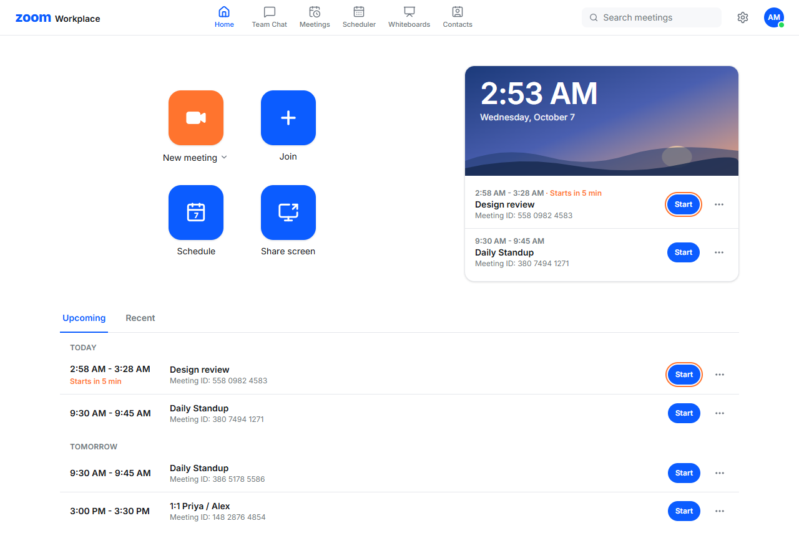
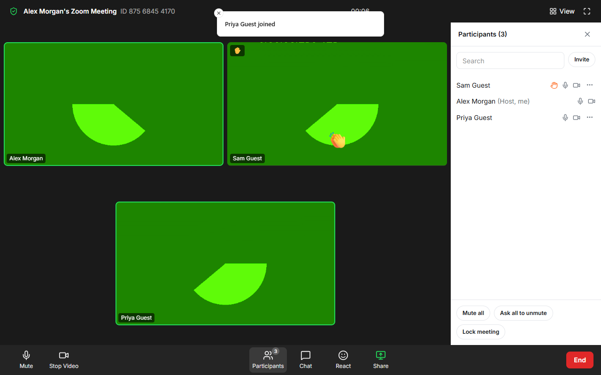
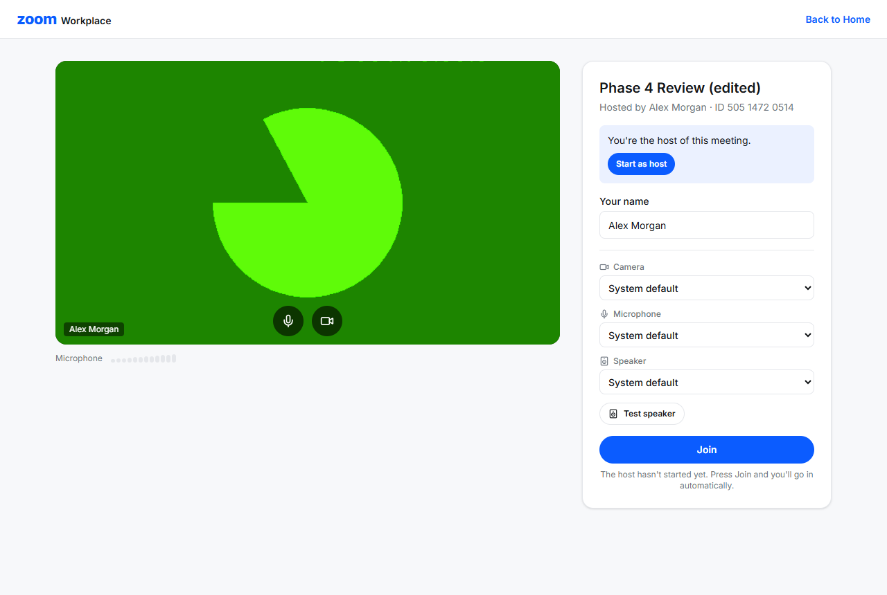
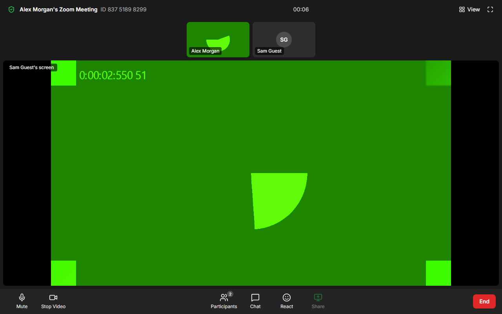
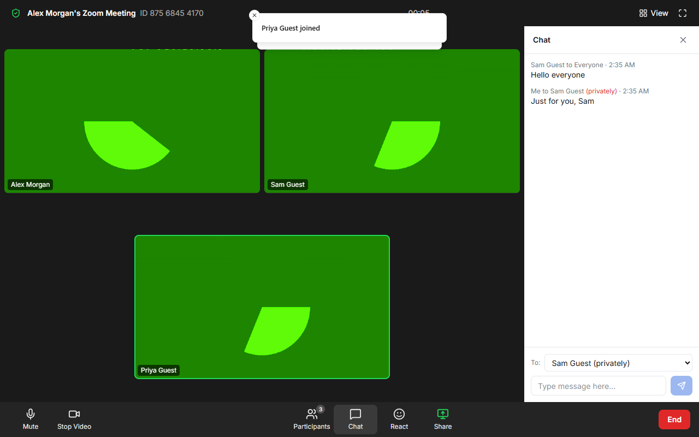
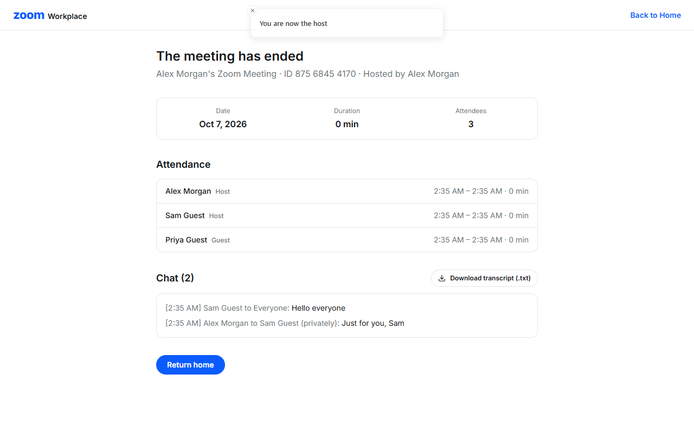
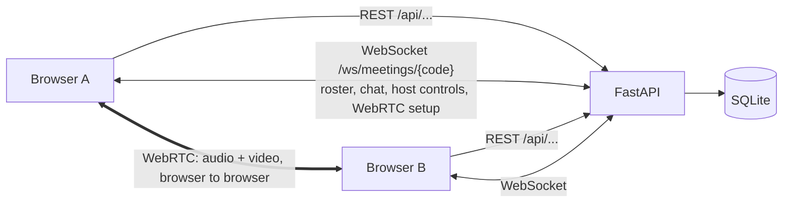
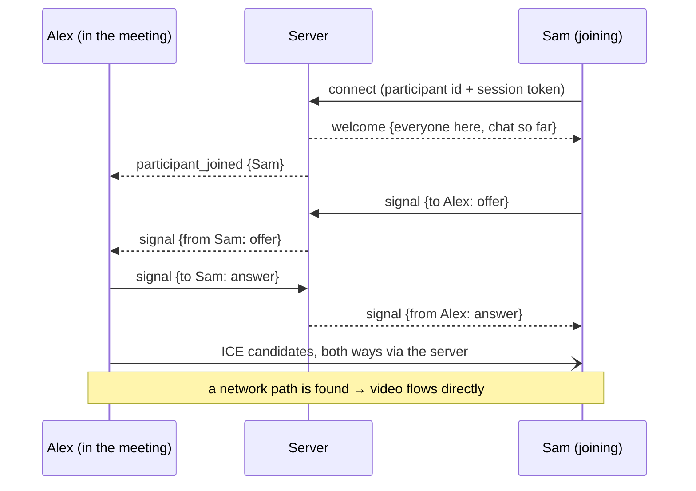
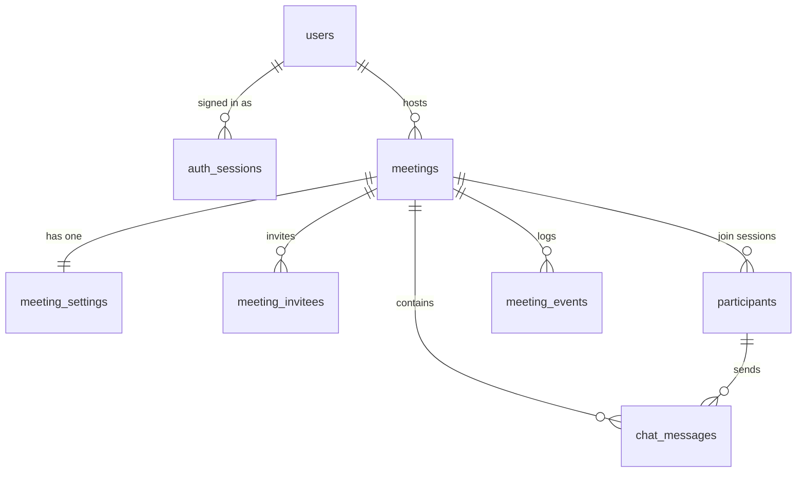

# Zoom Clone

A Zoom-style video conferencing web app. Schedule meetings, start one in a click, invite
people with a link, and meet on video with chat, reactions, raise hand, screen sharing,
a waiting room and host controls, then get a summary of who attended and what was said.

**Live demo:** _add your Vercel address here after deploying_ · **API:** _add your Render
address here_ (the free backend may take ~1 minute to wake up).

**Demo account:** `alex.morgan@example.com` / `demo1234` (or click **Log in as the demo
user** on the login page). You can also sign up with any email.

| Dashboard | Meeting (participants panel, raised hand, reaction) |
|---|---|
|  |  |
| **Pre-join device check** | **Screen sharing** |
|  |  |
| **Chat (private message shown)** | **Post-meeting summary** |
|  |  |

More: [schedule](docs/screenshots/schedule.png) ·
[waiting room](docs/screenshots/waiting-room.png) ·
[phone](docs/screenshots/phone-meeting.png).
(The green shapes are the browser's built-in test camera used in automated tests.)

## Features

- **Accounts:** sign up, log in and sign out (email + password). Hosting and scheduling
  need an account; joining by link doesn't, as in Zoom.
- **Dashboard:** New meeting (with your Personal Meeting ID option), Join, Schedule, Share
  screen; a live clock; upcoming meetings with a "Starts in 5 min" nudge; recent meetings.
- **Meetings page:** upcoming, previous and personal room; edit, cancel, copy invitation,
  add to calendar (.ics / Google Calendar).
- **Schedule:** Zoom's form (date, time, duration, time zone, recurring, passcode, waiting
  room, video and mute options, invitees) → an invitation ready to copy.
- **Join:** paste any meeting ID or link (or click "Paste meeting link from clipboard"); a
  pre-join screen with camera preview, mic level meter, device pickers and Test speaker;
  "waiting for the host" (with the scheduled time) until it starts, or straight in when
  the host allowed "join before host".
- **In the meeting:**
  - **Video:** peer-to-peer (WebRTC), gallery and speaker views, speaking outline, mute
    and stop video, in-room device menus, and a switch-camera button (front/back) on phones.
  - **Talking together:** chat (to everyone or private), reactions, a raise-hand queue.
  - **Screen and recording:** screen sharing, local recording, Zoom's keyboard shortcuts
    and push-to-talk.
- **Host controls:** waiting room (admit / deny / admit all), mute one or everyone, ask
  to unmute, remove, co-hosts, hand over the host role, lock the meeting, end for all.
  Every one is checked on the server.
- **Resilience:** a dropped connection reconnects into the same seat ("Reconnecting…").
  When the last person leaves, the meeting ends by itself, as in Zoom.
- **Afterwards:** a summary page with duration, attendance (every join and leave) and a
  chat transcript download.

## Tech stack and why

| Layer | Choice | Why |
|---|---|---|
| Frontend | Next.js 16 (App Router), TypeScript (strict), Tailwind CSS v4 | File-based routing, typed props, Zoom's look from design tokens |
| Server data | TanStack Query | Caching, loading/error states, and refreshing lists after a change |
| Room state | Zustand | One small store the meeting's many components read from |
| Backend | Python, FastAPI, Pydantic v2 | Typed validation, WebSockets built in, auto-generated API docs |
| Realtime | FastAPI WebSockets + browser WebRTC (mesh) | Video goes browser to browser; the server only relays setup messages and room events |
| Database | SQLite via SQLAlchemy 2.0 + Alembic | Zero setup; typed models; versioned, reviewable migrations |
| Auth | Email + password (scrypt), random session tokens stored hashed | No extra dependency; "Sign out" really ends the session |
| Tests & tooling | pytest (171 tests), Playwright, Ruff, ESLint, Prettier | One linter and formatter per language; a real-browser smoke test |

## Architecture



Pages come from Next.js (Vercel). Everything else is the FastAPI server: REST for
meetings and joining, plus one WebSocket per person during a meeting. The server
authenticates that WebSocket with a secret per-join token, keeps who's connected in
memory, saves history (chat, attendance, host actions) in SQLite, and checks the
sender's role for every host control. Video and audio don't touch the server.

### How a call is set up (WebRTC signaling)



The person who joins later always makes the first offer. "Perfect negotiation" (polite
and impolite peers) settles the rare case of two offers crossing later on.

## Database



- `meetings` is the hub. `meeting_settings` is 1:1 (its primary key *is* the meeting's id).
- `participants` has **one row per join session**, not per person: leaving and rejoining
  is two rows, which makes attendance exact.
- Chat references participants, not users, so guests can chat. A private message's
  recipient uses `ON DELETE CASCADE` so it can never turn public.
- `meeting_events` is an append-only audit log (joins, leaves, host actions).
- `auth_sessions` has one row per signed-in browser, holding only the SHA-256 of its token.
  `users.password_hash` holds a salted scrypt hash, never the password.
- Times are stored in UTC. Foreign keys, CHECKs and UNIQUE codes are enforced by SQLite.

## Run it locally

**Prerequisites:** Node.js 22 (pinned in `frontend/package.json`), Python 3.11+ (developed on 3.13).

### 1. Backend (terminal 1)

```bash
cd backend
python -m venv .venv
# Windows (PowerShell):  .venv\Scripts\Activate.ps1
# Windows (Git Bash):    source .venv/Scripts/activate
# macOS / Linux:         source .venv/bin/activate
pip install -r requirements-dev.txt
cp .env.example .env            # optional: defaults work for local dev
alembic upgrade head            # create/upgrade the tables in zoom_clone.db
uvicorn app.main:app --reload --port 8000
```

On first start the server fills the empty database with demo data (the demo account
Alex Morgan, colleagues, upcoming and past meetings; every demo account's password is
`demo1234`). To start over, delete
`zoom_clone.db*` and run `alembic upgrade head` again. Interactive API docs:
<http://localhost:8000/docs>.

### 2. Frontend (terminal 2)

```bash
cd frontend
npm install
cp .env.example .env.local      # optional: defaults point at localhost:8000
npm run dev
```

Open <http://localhost:3000> and log in (the login page has a **Log in as the demo user**
button), or sign up.

### Try a meeting with yourself

Hosts need an account; guests don't. A meeting has two "doors":
1. **Tab 1 (host):** log in, then Home → **New meeting**.
2. **Tab 2 (guest):** in the meeting, Participants → **Invite** copies the invitation.
   Open its link in a new tab (or a private window, signed out), type another name, and
   **Join**. A join through the link is always a guest, even in a signed-in browser.

Each tab keeps its own join ticket (sessionStorage), so the two tabs are two participants
and see each other's video. (On Windows, some camera drivers allow only one *browser* at a
time: use two tabs of the same browser.)

### Quality checks

```bash
# backend/
pytest                 # 171 tests: models, API, accounts, join rules, the room, host controls, security
ruff check . && ruff format --check .

# frontend/
npm run lint && npm run typecheck && npm run format:check
npm run test:e2e       # with both servers running: two browsers hold a real call
                       # (first time: npx playwright install chromium)
```

## Deployment (free tier)

Frontend on **Vercel**, backend on **Render** (its free web service supports WebSockets).
`render.yaml` describes the backend: it runs the migrations, then the server; the app
re-seeds demo data when the free tier's disk is wiped. Set `NEXT_PUBLIC_API_URL`
(`https://…`) and `NEXT_PUBLIC_WS_URL` (`wss://…`) on Vercel, and `CORS_ORIGINS` /
`FRONTEND_URL` (the Vercel address) on Render. A TURN server is optional
(`NEXT_PUBLIC_TURN_*`).

## API

Interactive docs at <http://localhost:8000/docs> when the backend is running. Signed-in
routes need `Authorization: Bearer <token>` (the docs page's **Authorize** button). Guests
need no account to look up a meeting and join it. A meeting's details, `.ics`, summary and
chat history are only for its host, signed-in users it involves, and guests sending their
join ticket as `X-Session-Token`. Too many wrong passwords or passcodes give 429.

| Method | Path | What it does |
|---|---|---|
| POST | `/api/auth/signup` | Create an account; returns a sign-in token → 201 |
| POST | `/api/auth/login` | Email + password → a sign-in token (401 if wrong) |
| POST | `/api/auth/logout` | End this browser's session → 204 |
| GET | `/api/me` | The signed-in user (401 without a valid token) |
| GET | `/api/meetings?scope=upcoming\|recent\|all` | Meetings I host, am invited to, or attended |
| POST | `/api/meetings/instant` | Start a meeting now (or my personal room) → 201 |
| POST | `/api/meetings` | Schedule a meeting → 201 |
| GET | `/api/meetings/resolve?q=...` | "Can I join this?" for an ID or any invite link |
| GET | `/api/meetings/{code}` | Meeting details, invite link, invitation text |
| PATCH | `/api/meetings/{code}` | Edit an upcoming meeting (host only) |
| DELETE | `/api/meetings/{code}` | Cancel (soft delete, host only) → 204 |
| POST | `/api/meetings/{code}/participants` | Join: host door (`join_as: host`) or guest door (token/passcode) → 201 with a session token |
| POST | `/api/meetings/{code}/start` · `/end` | Host starts / ends for everyone (ending also hangs up the room) |
| GET | `/api/meetings/{code}/ics` | Calendar file download |
| GET | `/api/meetings/{code}/summary` | Post-meeting recap: attendance and chat |
| GET | `/api/meetings/{code}/messages` | Public chat history |
| GET | `/api/health` | Liveness check |
| WS | `/ws/meetings/{code}?participant_id=…&session_token=…` | The live meeting room ([message list](backend/app/realtime/messages.py)) |

Errors always look like `{"detail": "..."}`: 403 not allowed · 404 unknown code ·
409 not possible in the meeting's current state · 422 invalid input · 503 retry.

## What I added and why

Beyond a plain clone, each one small and self-contained:

| Addition | Inspired by | Why |
|---|---|---|
| Smart join box + "Paste meeting link from clipboard" | Zoom, Google Meet | Paste anything (ID with or without spaces, any invite link) and it works |
| Pre-join device check: preview, mic meter, Test speaker | Google Meet's green room | Fewer "can you hear me?" moments |
| Active-speaker detection (green outline, speaker view) | Zoom | Speaker view follows whoever is talking |
| Push-to-talk (hold Space) and Zoom's shortcuts with a `?` cheat sheet | Zoom desktop; "?" overlays in GitHub / Gmail | Fast control without the mouse |
| Ordered raise-hand queue | Google Meet | Hosts call on people in the order they asked |
| Calendar without OAuth: .ics + Google Calendar link | Calendly | Works with any calendar, no sign-in |
| Post-meeting summary: attendance timeline + transcript | Microsoft Teams recap | Who came, for how long, and what was said |
| "Starts in 5 min" nudge with a highlighted Start | Google Calendar reminders | The host doesn't miss the start |
| Reconnect into the same seat after a drop or refresh | Zoom | A Wi-Fi blip doesn't kick you out |
| Local recording (tab + meeting sound + your mic → .webm) | Zoom local recording | Real recording without a media server |

Skipped on purpose (more code and risk than value for a demo): live captions,
network-quality bars, background blur.

## Security

A review with Cloudflare's security-audit checklists found and fixed 7 issues, the
worst being that a meeting's ID alone revealed its passcode. The fixes are covered by
`backend/tests/test_security.py`.

## Assumptions / Mocked Data / Notes

### Assumptions

- **Accounts are for hosts:** you need one to host, schedule and see your meetings. Anyone
  joining by ID or link is an anonymous guest who needs the invite token or the passcode.
- **Mesh video:** every browser connects to every other. Good up to about 6 people.
- **One backend instance:** who's in which meeting is kept in that server's memory.
- **Recurring meetings** are a label ("every week") with one meeting ID, like Zoom's.
- **Times** are stored in UTC and shown in a chosen time zone (the account's time zone
  by default, changeable when scheduling).
- **Browsers:** built and tested in Chromium-based browsers (Chrome, Edge); the automated
  test runs Chromium. Camera and microphone need HTTPS or `localhost`.

### Mocked data

- **Demo data is seeded on first start** ([`backend/app/seed_data.py`](backend/app/seed_data.py)):
  4 made-up colleagues (Alex Morgan, Priya Sharma, Daniel Kim, Sofia Rossi, all
  `@example.com`, password `demo1234`), each with a personal room; 7 upcoming meetings
  (one always later today); and 10 past meetings with attendance, chat and two guests,
  so the dashboard, Meetings page and summaries have something to show.
- Seeded times are relative to when the server starts ("tomorrow 9:30"), so the data
  never goes stale.
- Seeded accounts count as email-verified; new sign-ups don't (see below).

### What is simplified or not real

- **No email is sent.** Invitees are stored and an invitation text is generated to copy
  and paste. So there's no email verification and no "forgot password". Because an
  address is never proven, a new account doesn't see meetings it was invited to by email.
- **Recording is local only:** the `.webm` downloads to the person recording; no cloud
  recording.
- **Calendar** is a `.ics` download and a Google Calendar link, not a calendar API sync.
- **Mute is cooperative:** the host's mute is carried out by the guest's browser (with
  a mesh there's no media server to enforce it).
- **STUN only by default:** calls between some strict networks need a TURN server
  (`NEXT_PUBLIC_TURN_*`).

### Notes for reviewers

- **Quickest test:** log in with **Log in as the demo user**, click **New meeting**, then
  open the invite link in a second tab and join as a guest. The two tabs see each other.
- **The free backend sleeps** after 15 minutes idle; the first request may take about a
  minute.
- **The free tier's database resets** on each deploy or restart; the demo data comes
  back by itself.
- **Checks:** `pytest` (171 tests), Ruff, ESLint, TypeScript, Prettier and a two-browser
  Playwright test all pass (commands under [Quality checks](#quality-checks)).

## Known limitations and what I'd do next

- **Scale:** replace the mesh with an SFU (LiveKit or mediasoup), so each person uploads
  once and meetings can hold dozens of people. Hosts could then also *enforce* a mute.
- **More than one server:** Redis pub/sub to share room messages between backend
  instances, and Postgres instead of a SQLite file.
- **Accounts:** login rate limiting, password reset by email, "Sign in with Google",
  and banning removed people by account.
- **Security:** end-to-end encryption (WebRTC insertable streams) and short-lived TURN
  credentials issued by the backend.
- **Product:** captions, cloud recording, breakout rooms, automatically passing the host
  role on when a host's connection drops.

## Code tour: the 10 files to read first

1. [`backend/app/main.py`](backend/app/main.py): how the server is assembled: CORS, one
   error handler for all business-rule errors, the routers.
2. [`backend/app/models/participant.py`](backend/app/models/participant.py): the key table:
   one row per join session, and the secret session token.
3. [`backend/app/services/meeting_service.py`](backend/app/services/meeting_service.py):
   meeting rules: host checks, unique codes (retry on collision), start and end.
4. [`backend/app/services/participant_service.py`](backend/app/services/participant_service.py):
   the two doors into a meeting (host and guest), the waiting room and the lock.
5. [`backend/app/realtime/room_handler.py`](backend/app/realtime/room_handler.py): one
   WebSocket's life: authenticate, enter, a table of message handlers, depart.
6. [`backend/app/realtime/host_controls.py`](backend/app/realtime/host_controls.py):
   server-side authorization for every host action.
7. [`frontend/lib/api.ts`](frontend/lib/api.ts): the only place the frontend calls REST,
   with a type for every response.
8. [`frontend/components/prejoin/PrejoinScreen.tsx`](frontend/components/prejoin/PrejoinScreen.tsx):
   camera/mic check, joining, and waiting for the host.
9. [`frontend/lib/roomConnection.ts`](frontend/lib/roomConnection.ts): the browser side of
   the room: socket, reconnecting, one WebRTC link per person, store updates.
10. [`frontend/lib/peerLink.ts`](frontend/lib/peerLink.ts): one WebRTC connection: who
    calls whom, perfect negotiation, swapping tracks.

Accounts: [`backend/app/deps.py`](backend/app/deps.py) (`get_current_user`) and
[`backend/app/services/auth_service.py`](backend/app/services/auth_service.py), then
[`frontend/hooks/useAuth.ts`](frontend/hooks/useAuth.ts).

## Project structure

```
backend/    FastAPI app
  app/main.py, config.py, db.py, deps.py   entry point, settings, sessions, dependencies
  app/models/        one file per table (+ enums.py, types.py)
  app/schemas/       Pydantic request/response shapes
  app/routers/       thin HTTP layer: health, users, meetings, participants, room (WebSocket)
  app/services/      business rules: meeting, join, participant, room, summary, ics, codes
  app/realtime/      the live room: messages, room_manager, room_handler,
                     meeting_features, host_controls, room_entry, room_context
  app/seed.py        demo data (described in seed_data.py)
  alembic/           database migrations
  tests/             pytest suite (factories.py and room_helpers.py = shared helpers)
frontend/   Next.js app
  app/               pages: (main)/ dashboard, meetings, schedule · join/ · j/[code] pre-join
                     · room/[code] meeting room and /ended summary
  components/        ui/ primitives · home/ · meetings/ · schedule/ · join/ · prejoin/ · meeting/
  hooks/             React Query hooks, media, room connection, screen share, shortcuts, ...
  lib/               api.ts, roomConnection.ts, peerLink.ts, roomProtocol.ts, formatting, ...
  stores/            roomStore.ts (Zustand)
  e2e/               Playwright smoke test
docs/       screenshots used in this README
render.yaml backend deployment (Render free tier)
```

## Conventions (for anyone taking over this code)

- **Every non-trivial file starts with a short header**: what it's for, who calls it,
  what it calls.
- **Readable over clever.** Keyword arguments, named things over list positions, no
  one-letter aliases, no packed one-liners. Constants are named and commented.
- **Layers (backend):** routers stay thin; rules live in `services/`; tables in `models/`;
  the live room in `realtime/` (each message type has one handler function).
- **One API client (frontend):** only `frontend/lib/api.ts` calls `fetch` for REST.
- **`INTERVIEW:` comments** mark the decisions most worth understanding.
- **Schema changes:** edit the model, `alembic revision --autogenerate -m "..."`, *read*
  the generated file, then `alembic upgrade head`. `pytest` fails if models and
  migrations drift apart.
- **Tests read as sentences**, and each test file starts with the list of behaviors it proves.
